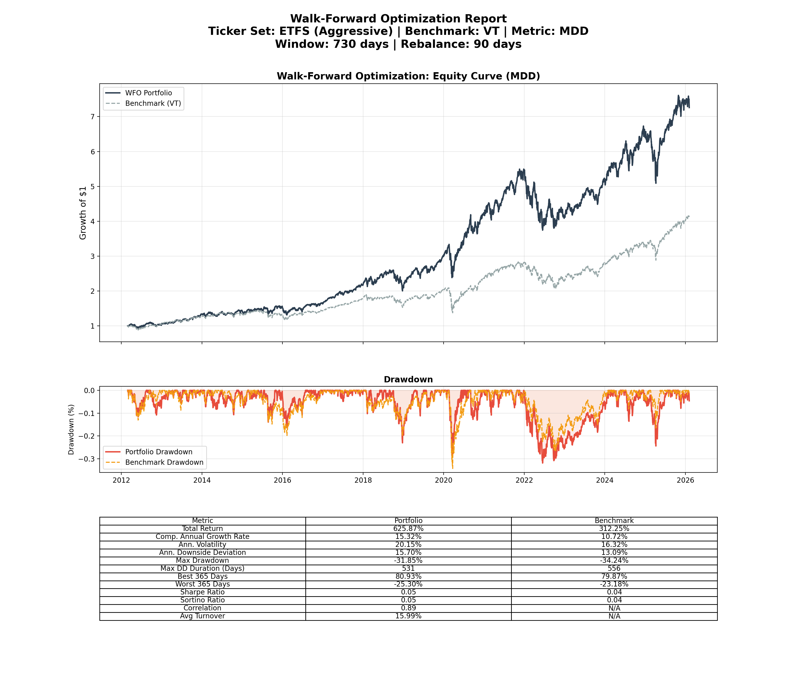
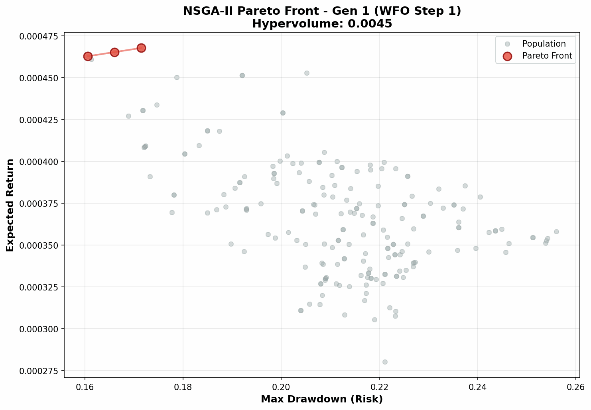
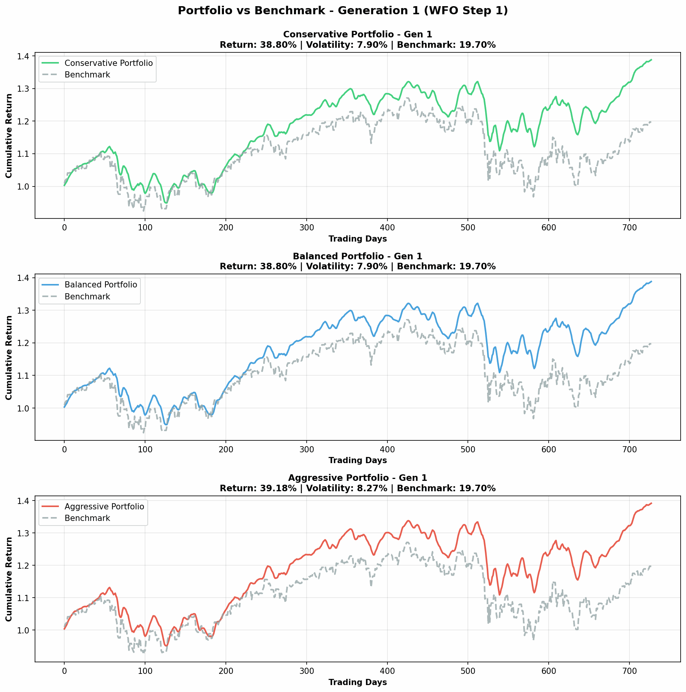

# Portfolio Optimization with NSGA-II

A multi-objective portfolio optimization tool using the NSGA-II evolutionary algorithm with Walk-Forward Optimization (WFO) for robust backtesting. The system optimizes portfolio weights to maximize returns while minimizing risk, comparing results against the Markowitz efficient frontier and market indices.

## Showcase (Aggressive Strategy)

The following charts demonstrate the performance of an optimized aggressive portfolio strategy over time.

### Performance Factsheet



### Optimization Process (single time window)

Evolution of the Pareto front and comparison with market benchmarks during the first Walk-Forward window.

|                    Pareto Front Optimization                     |                         Strategy vs Benchmark                          |
| :--------------------------------------------------------------: | :--------------------------------------------------------------------: |
|  |  |

## Features

- **Multi-Objective Optimization**: Find optimal trade-offs between return and risk using NSGA-II.
- **Walk-Forward Optimization (WFO)**: Robust backtesting methodology to mitigate look-ahead bias and simulate real-world rebalancing.
- **Dynamic Universe Filtering**: Filter assets based on historical liquidity (`--min-liquidity`) to address survivorship bias.
- **Transaction Costs**: Optional modeling of transaction costs to provide more realistic net returns.
- **Preprocessing Options**: Control data smoothing (`--use-smoothing`) and handling of missing market days (`--fill-missing`).
- **Multiple Risk Metrics**: Optimize for Volatility (std), Max Drawdown (MDD), or Sharpe Ratio.
- **Comprehensive Reporting**: Generates detailed factsheets (Equity Curve, Drawdown, Metrics Table) and animated GIFs of portfolio evolution.
- **Markowitz Comparison**: Automated baseline against analytical efficient frontiers.
- **Automated Data Fetching**: Integrated `yfinance` support for global assets.
- **Reproducibility**: Seed support for consistent experimental results.
- **Rich Visualization**: Automated generation of Pareto fronts and performance charts.
- **Configurable via CLI**: Flexible command-line interface for easy experimentation.

## Installation

```bash
uv sync
```

## Usage

```bash
uv run python main.py [OPTIONS]
```

### Options

| Option                | Description                                                           | Default      |
| --------------------- | --------------------------------------------------------------------- | ------------ |
| `--ticker-set`        | Asset set (`WIG20`, `WIG_BROAD`, `US_TECH`, etc.)                     | `WIG_BROAD`  |
| `--risk-metric`       | Objective: `std`, `mdd`, or `sharpe`                                  | `std`        |
| `--seed`              | Random seed for reproducibility                                       | `None`       |
| `--pop-size`          | Population size                                                       | `100`        |
| `--n-generations`     | Number of generations                                                 | `50`         |
| `--callback-interval` | Save Pareto front plots every N generations (e.g. 10)                 | `10`         |
| `--train-window`      | Training window size in days (e.g. 1008 = 4 years)                    | `1008`       |
| `--rebalance-freq`    | Rebalancing frequency in days (e.g. 90 = 1 quarter)                   | `90`         |
| `--start-date`        | Data start date (YYYY-MM-DD)                                          | `2010-01-01` |
| `--benchmark`         | Benchmark ticker (optional)                                           | Synthetic    |
| `--use-smoothing`     | Apply moving average smoothing to prices                              | `False`      |
| `--fill-missing`      | Interpolate prices for missing calendar days                          | `False`      |
| `--transaction-cost`  | Transaction cost per rebalance (e.g. 0.0025 = 0.25%%)                 | `0.0025`     |
| `--min-liquidity`     | Minimum average daily turnover (Price\*Vol) to consider a stock valid | `500000.0`   |
| `--quiet`             | Suppress detailed output (e.g., progress bars)                        | `False`      |

### Examples

**Reproducible US Tech run:**

```bash
uv run python main.py --ticker-set US_TECH --seed 42 --n-generations 100
```

**Crypto Max Drawdown optimization:**

```bash
uv run python main.py --ticker-set CRYPTO --risk-metric mdd --pop-size 300
```

**WIG Broad universe with liquidity filter and costs:**

```bash
uv run main.py --ticker-set WIG_BROAD --risk-metric sharpe --start-date 2010-01-01 --min-liquidity 1000000 --transaction-cost 0.005
```

**Track evolution progress with intermediate Pareto fronts every 10 generations:**

```bash
uv run python main.py --ticker-set US_TECH --n-generations 100 --callback-interval 10
```

## Output

Results saved to `plots/wfo-{TIMESTAMP}/`:

- `config.yaml`: Run parameters and seed.
- `conservative/`, `balanced/`, `aggressive/`: Profile-specific results folders containing:
  - `wfo_factsheet.png`: Comprehensive factsheet including Equity Curve, Drawdown, and Metrics Table.
  - `portfolio_evolution.gif`: Animated GIF showing portfolio composition changes over time.
- `step_{N}_intermediate/`: Intermediate Pareto front plots saved every `--callback-interval` generations during evolution.
  - `pareto_gen_{XXXX}.png`: Pareto front at generation XXXX showing both population and optimal front.

## Project Structure

```
├── main.py                 # CLI entry point
├── pyproject.toml          # Config & dependencies
├── src/
│   ├── crossovers.py       # Crossover operators
│   ├── data.py             # Data fetching
│   ├── evolution.py        # NSGA-II engine
│   ├── mutations.py        # Mutation operators
│   ├── plots.py            # Visualization
│   ├── selections.py       # Selection logic
│   ├── tickers.py          # Asset sets
│   └── utils.py            # Financial metrics & Markowitz
├── notebooks/              # Interactive analysis
└── plots/                  # Saved outputs
```

## Known Limitations

This tool provides a powerful framework for portfolio optimization. However, it's crucial to understand its inherent limitations, especially when interpreting backtesting results:

- **Survivorship Bias**: A key challenge with free data. Using static lists of current tickers (e.g., `WIG20`, `US_TECH`) implicitly ignores past bankruptcies or delistings, creating an optimistic bias.
  - **ETFS Robustness**: This bias is minimal for the `ETFS` set, as ETFs automatically handle internal turnover of underlying assets.
  - **Mitigation**: Our `min-liquidity` filter removes illiquid assets in each window, but historical results should still be viewed as an optimistic upper bound.
- **Data Quality & Completeness (`yfinance`)**:
  - `yfinance` data can be incomplete, especially for older periods or less liquid stocks. Merged or delisted companies often have their historical data removed or ticker symbols changed, making true survivorship-bias-free backtesting extremely difficult.
  - Errors in dividend adjustments or splits can lead to artificial price spikes/drops, which the algorithm might exploit unrealistically.
- **Transaction Costs Model**: The current model applies a flat percentage cost (`--transaction-cost`) to the entire portfolio value at each rebalancing step. This is a simplification.
  - A more granular model would calculate costs based on the actual _turnover_ (percentage of portfolio rebalanced) and specific commission rates, plus slippage based on market depth.
- **Liquidity Filter (`--min-liquidity`)**: While effective at filtering out truly illiquid assets, it's a proxy for market capitalization and tradability. It might exclude valid but temporarily less liquid stocks or include those that were liquid but still poor performers.
- **Optimization Assumptions**: Evolutionary algorithms, like traditional Markowitz optimization, rely on historical data and assume that past relationships (returns, correlations, volatilities) will hold true to some extent in the future. This is rarely perfectly the case.
  - They also assume a rational market and that historical risk-return profiles accurately represent future opportunities.
- **No Short Selling / Leverage**: The current model assumes a long-only portfolio with no leverage, which simplifies the problem but might not reflect all real-world trading strategies.
